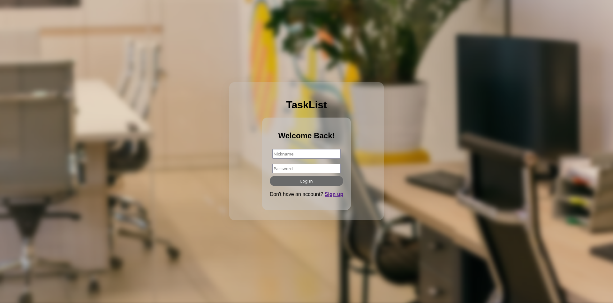
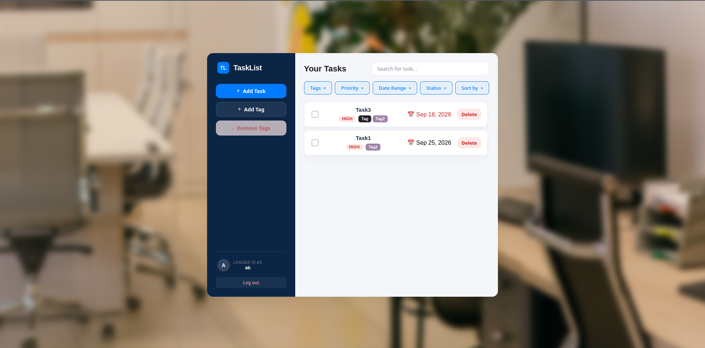
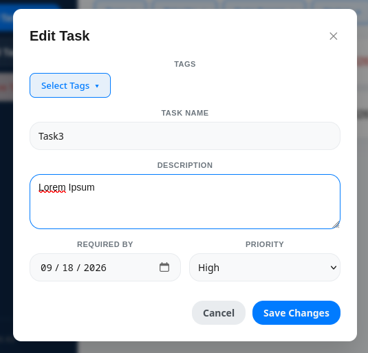
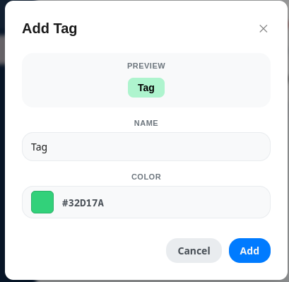

## About

This is responsive web app designed to help keep track of responsibilities and obligations in a form of a to-do task list.

### Visuals
**[Watch 3-Minute Video Demo](./demo-tasklist.mp4)**

#### Login page



#### Main dashboard


#### Window for task creation


#### Window for tag creation


## Features
- Dynamic filtering and sorting tasks (tags, priorities, dates, etc.)
- Optimistic UI design, debouncer for "spammable" requests
- Authorisation and Session management through API
- Interactive tag creation with color-picking and cascade deletion.

## Tech stack
- **Frontend**: Svelte 5, TypeScript, Vite
- **Backend**: Express, TypeScript, SQLite

## Quick Start

To install dependencies, build both client & server, and copy static files in a single step:

```bash
npm run build
npm start